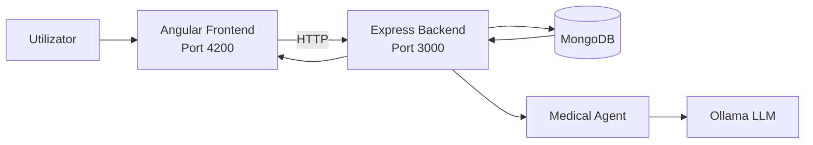
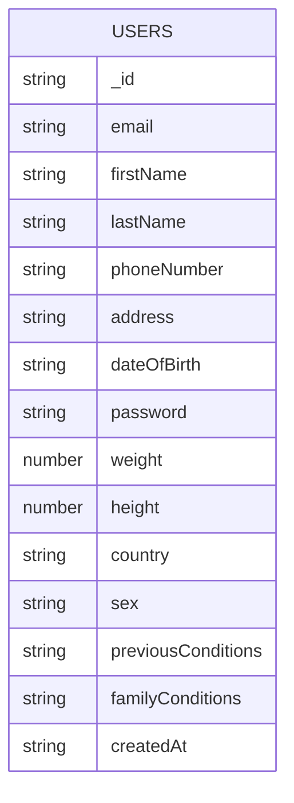

# MedHelp — documentație pentru prezentare

Mai jos ai o variantă scurtă, structurată pe slide-uri, cu cele mai importante idei despre proiect. Poate fi copiată direct într-un PowerPoint / Google Slides.

## Slide 1 — Titlu
- **MedHelp**
- Aplicație web full-stack pentru triaj medical asistat de AI
- Scop: colectarea simptomelor, folosirea profilului utilizatorului și generarea de întrebări/recomandări personalizate
- Tehnologii principale: Angular, Node.js/Express, MongoDB, Ollama

## Slide 2 — Ce face aplicația
- Utilizatorul se înregistrează și se autentifică
- Completează un profil medical de bază
- Intră în chat-ul de triaj și descrie simptomele
- Backend-ul combină istoricul conversației cu datele profilului
- Modelul AI răspunde cu întrebări de clarificare sau cu un răspuns final

## Slide 3 — Arhitectura generală
- Frontend: aplicație Angular care rulează pe portul `4200`
- Backend: API Node.js + Express pe portul `3000`
- Bază de date: MongoDB pentru utilizatori și profiluri
- AI local: Ollama pentru generarea răspunsurilor medicale
- Frontend-ul comunică doar cu backend-ul, nu direct cu baza de date sau cu Ollama

## Slide 4 — Structura bazei de date
- Baza de date folosește colecția principală `Users`
- Fiecare utilizator salvează date de autentificare + profil medical
- Chat-ul este gestionat în prezent în memorie pe backend, pe sesiuni per email
- Nu există încă o colecție separată pentru conversații persistente

## Slide 5 — Datele salvate pentru utilizator
- Date personale: nume, prenume, email, telefon, adresă, data nașterii
- Date de autentificare: parolă hash-uită și token JWT la login
- Date medicale: greutate, înălțime, sex, țară, condiții anterioare, antecedente familiale
- Backend-ul returnează un profil „safe”, fără date sensibile inutile pentru UI

## Slide 6 — Fluxul de autentificare
- Pagina de înregistrare trimite datele către `POST /register`
- Login-ul folosește `POST /login`
- La autentificare reușită, backend-ul returnează un JWT
- Token-ul este salvat în `localStorage` și este folosit ulterior pentru identificarea utilizatorului
- Endpoint-ul `GET /profile` citește profilul utilizatorului pe baza token-ului

## Slide 7 — Modulul AI / triaj
- Chat-ul trimite mesajele către `POST /ai/chat`
- Backend-ul caută profilul utilizatorului după email
- Se creează/stochează o sesiune de conversație în memorie
- Agentul medical formulează întrebări scurte, de tip yes/no, pentru a restrânge simptomul
- Răspunsul final este marcat prin `isFinal: true`
- Există și endpoint-ul `POST /ai/reset` pentru resetarea sesiunii

## Slide 8 — Ecranele principale existente
- **Home** — pagina de intrare în aplicație
- **Login** — autentificarea utilizatorului
- **Register** — crearea contului și completarea profilului medical
- **Dashboard** — ecran intermediar după login
- **Chat** — interfața principală pentru triajul medical

## Slide 9 — Componente importante ale proiectului
- Backend:
  - `user.routes.js` și `ai.routes.js` pentru endpoint-uri
  - `user.controller.js` pentru login, register și profil
  - `ai.controller.js` pentru chat și reset
  - `database.service.js` pentru conexiunea la MongoDB
  - `auth.service.js` pentru JWT și parole hash-uite
- Frontend:
  - componente standalone pentru home/login/register/dashboard/chat
  - servicii pentru autentificare și triaj AI

## Slide 10 — Concluzii și direcții viitoare
- Proiectul oferă un flux complet: autentificare → profil medical → chat AI
- Arhitectura este clar separată între UI, API, DB și AI
- Punct forte: personalizarea răspunsurilor pe baza profilului utilizatorului
- Posibile îmbunătățiri:
  - persistarea conversațiilor în baza de date
  - istoric medical mai bogat
  - dashboard cu statistici și recomandări
  - validări și securitate extinse

---

### Observație
Această variantă este intenționat scurtă și potrivită pentru o prezentare de curs/seminar. Dacă vrei, o pot transforma și într-o variantă mai „de prezentare” cu text scurt pe slide și notițe pentru vorbitor.