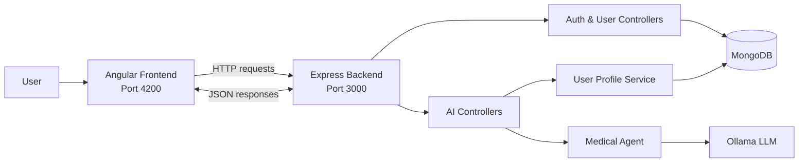

# MedHelp

MedHelp is a full-stack medical triage application. It guides a user through a symptom conversation, combines that conversation with the user’s stored profile data, and uses a locally hosted LLM through Ollama to produce follow-up questions and a final diagnosis-style recommendation.

This README is written for new contributors who want to understand how the app is structured, how the frontend talks to the backend, and where the key pieces live.

## What the app does

The app follows a simple flow:

1. A user registers and logs in.
2. The backend stores the user profile in MongoDB and returns a JWT on login.
3. The Angular frontend sends the JWT-based user identity to the backend when needed.
4. The chat screen sends symptom messages to the AI backend.
5. The backend loads the user profile, keeps a per-user chat session in memory, and calls Ollama.
6. Ollama returns the next triage question or a final answer.

The overall goal is to make the conversation feel personalized by using:

- the user’s profile fields, and
- the recent chat history for that user.

## High-level architecture

The project is split into two apps:

- **Frontend**: Angular 17 single-page app running on port `4200`
- **Backend**: Node.js + Express API running on port `3000`
- **Database**: MongoDB for user accounts and profile data
- **AI provider**: Ollama running locally, using the model configured in `.env`

The frontend never talks directly to MongoDB or Ollama. It only talks to the backend over HTTP. The backend is the integration layer that handles authentication, profile lookup, session state, and AI requests.

### Architecture diagram



The diagram shows the main path: the user interacts with Angular, Angular calls the backend API, the backend loads profile data from MongoDB when needed, and the medical agent calls Ollama to produce the chat response.

## How the frontend and backend communicate

### Frontend to backend

The Angular app uses `HttpClient` to call the backend at `http://127.0.0.1:3000`.

Main requests:

- `POST /register` — create a new user account
- `POST /login` — authenticate a user and receive a JWT
- `GET /profile` — fetch the signed-in user profile using the `Authorization: Bearer <token>` header
- `POST /ai/chat` — send a symptom message to the medical triage agent
- `POST /ai/reset` — clear the in-memory chat session for that user

### What the frontend sends for chat

The chat service decodes the JWT stored in `localStorage` and extracts the user email. It then sends:

```json
{
  "email": "user@example.com",
  "message": "I have a fever and sore throat"
}
```

The backend uses the email as the session key. That lets it keep one chat state per user without requiring the frontend to manage conversation state itself.

### What the backend returns for chat

The AI endpoint returns a compact response shape:

```json
{
  "reply": "...",
  "isFinal": false
}
```

- `reply` is the assistant message displayed in the chat UI.
- `isFinal` tells the frontend whether the triage conversation is complete.

## End-to-end user flow

### 1) Registration and login

The user flow starts in the auth screens:

- `RegisterComponent` collects the personal and medical profile fields.
- `LoginComponent` authenticates the user.

On the backend:

- `POST /register` validates the payload with Joi and stores the user in MongoDB.
- `POST /login` looks the user up by email, verifies the password, and returns a JWT.

The JWT is stored on the client and later reused to identify the user.

### 2) Dashboard

The dashboard acts as a landing screen after login. It does not currently contain complex server-driven logic. It mainly gives the user a place to continue into the chat experience or log out.

### 3) Chat / triage

The chat view is the core feature:

- the user types a symptom message,
- the Angular `TriageService` posts that message to `/ai/chat`,
- the backend loads the user profile from MongoDB,
- the backend builds a prompt that includes profile context and recent memory,
- the backend sends the prompt to Ollama,
- the frontend renders the reply,
- if `isFinal` is `true`, the UI stops accepting more messages.

The AI session is kept in memory on the backend in a `Map`, keyed by normalized email. That means the chat remembers a user’s recent conversation while the server stays alive, but it is not yet persisted to the database.

## Backend structure

The backend code lives in `backend/src`.

### Entry points

- `backend/server.js` — thin launcher that starts the real server file
- `backend/src/server.js` — Express app setup, middleware, route registration, and MongoDB connection startup

### Routes and controllers

- `backend/src/routes/user.routes.js` — routes for login, register, and profile
- `backend/src/controllers/user.controller.js` — request validation and auth/profile logic
- `backend/src/routes/ai.routes.js` — chat/reset routes
- `backend/src/controllers/ai.controller.js` — AI session management and response formatting

### Services

- `backend/src/services/database.service.js` — MongoDB connection helper
- `backend/src/services/auth.service.js` — user lookup, password verification, JWT signing/verifying

### AI layer

- `backend/src/ai/ollamaClient.js` — sends requests to Ollama
- `backend/src/ai/systemPrompt.js` — builds the system prompt used by the model
- `backend/src/ai/userProfileService.js` — loads profile context from MongoDB
- `backend/src/ai/medicalAgent.js` — manages conversation memory and one turn of triage logic
- `backend/src/ai/cli.js` — command-line helper for AI experiments

## Frontend structure

The frontend code lives in `frontend/src/app`.

### Pages and components

- `components/home` — entry page
- `components/login` — login screen
- `components/register` — registration form
- `components/dashboard` — post-login landing page
- `components/chat` — triage chat UI

### Services

- `services/auth.service.ts` — handles registration, login, profile requests, logout, and some partner-related endpoints
- `services/triage.service.ts` — sends chat messages and reset requests to the AI backend
- `services/ai.service.ts` — additional AI-related client logic if needed by the UI

### Routing

The main routes are defined in `frontend/src/app/app.routes.ts`:

- `/home`
- `/login`
- `/register`
- `/dashboard`
- `/chat`

The root path redirects to `/home`.

## Key implementation details

### User profile data

The registration form stores fields such as:

- name and contact details
- date of birth
- height / weight
- sex and country
- previous and family conditions

The profile endpoint returns a sanitized subset of this data so the frontend can display or reuse it safely.

### AI session memory

The backend keeps a short in-memory conversation state for each user:

- chief complaint
- recent messages
- a basic question counter

This memory is used to keep the triage conversation coherent across turns.

### Ollama integration

The medical agent builds a system prompt that combines:

- the user profile
- recent conversation facts
- the current question count

It then sends the prompt to Ollama and interprets the response. When the model produces a response that starts with `FINAL DIAGNOSIS:`, the backend marks the conversation as complete.

## Configuration

The backend expects environment variables in the repo root `.env` file.

Common values:

- `MONGO_CONNECTION_STRING` — MongoDB connection string
- `DB_NAME` — database name, defaulting to `MedHelp` if omitted
- `OLLAMA_URL` — Ollama server URL
- `OLLAMA_MODEL` — model name used for triage

The backend loads `.env` from the repository root, so keep that file at the top level of the project.

## Running locally

From the repository root:

```bash
./run-app.sh
```

That script starts both services together.

You can also run them separately:

```bash
cd backend
npm install
npm start

cd ../frontend
npm install
npm start
```

Then open the frontend at `http://localhost:4200`.

Make sure these services are available before testing the chat:

- MongoDB
- Ollama with the configured model pulled locally

## Current design constraints

- Chat sessions are stored in memory, so they disappear when the backend restarts.
- The frontend relies on the JWT payload to extract the user email for AI requests.
- The app is built for local development, so the backend URLs are hardcoded to `127.0.0.1:3000` in the Angular services.

## Good next improvements

- Persist chat history in MongoDB instead of memory only
- Add route guards for protected pages like dashboard and chat
- Centralize API base URLs in Angular environment files
- Add tests for auth, profile, and AI session behavior
- Add a clearer loading/error state in the chat UI

## Project layout

```text
MedHelp/
├── backend/
│   ├── src/
│   │   ├── ai/
│   │   ├── controllers/
│   │   ├── routes/
│   │   └── services/
│   └── server.js
├── frontend/
│   └── src/
│       ├── app/
│       │   ├── components/
│       │   ├── guards/
│       │   └── services/
│       └── styles.css
├── run-app.sh
└── README.MD
```

## Notes for contributors

- Keep the backend response contracts stable, especially for `/ai/chat` and `/login`.
- Be careful when changing the token payload, because the frontend currently decodes it directly.
- If you add new API routes, document them here so the next developer can understand the flow quickly.