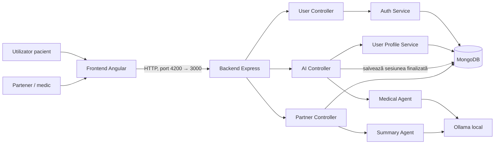
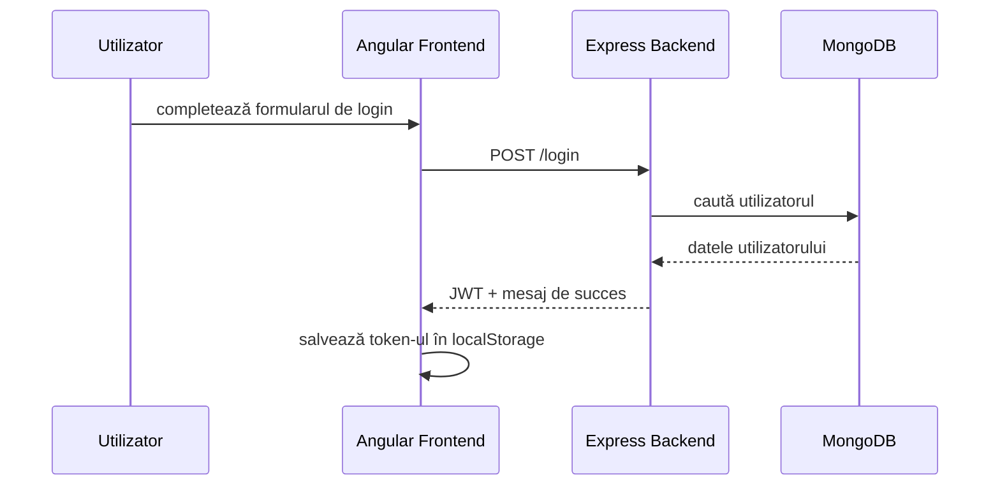
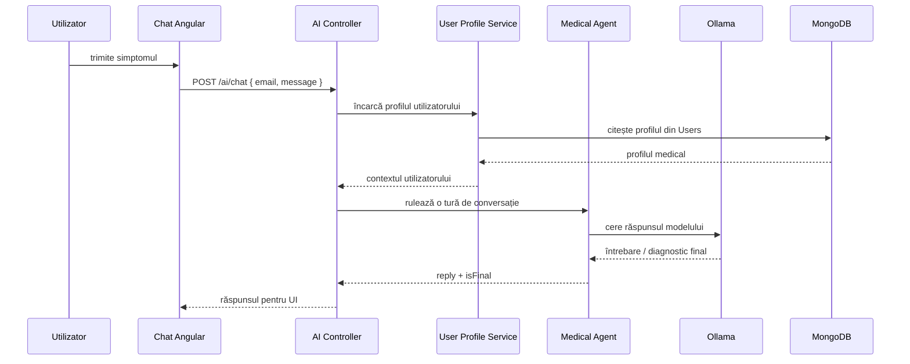
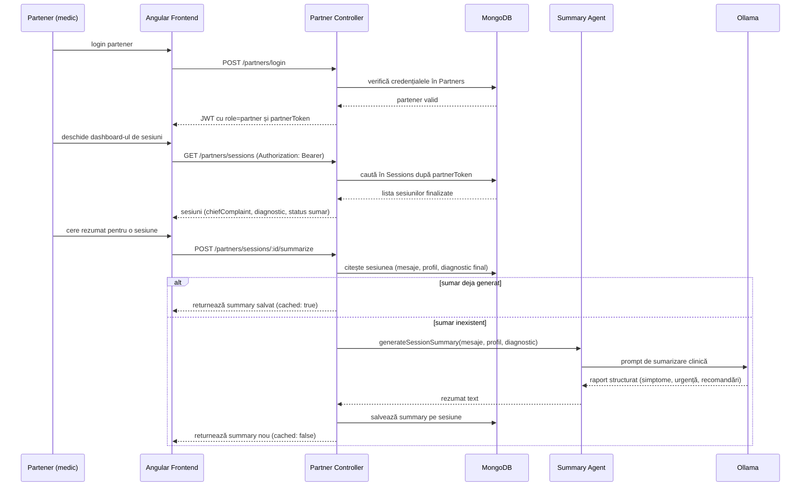
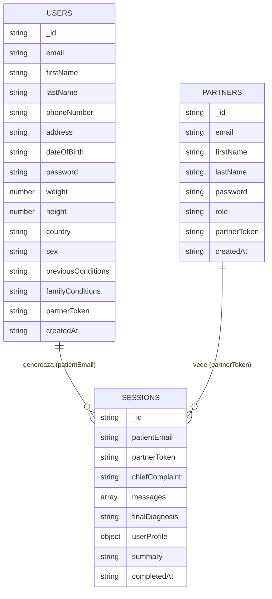

# Documentație proiect — MedHelp

Acest document centralizează toate artefactele cerute pentru proiect: confirmarea cerințelor, arhitectură, diagrame, specificații, backlog, proces de dezvoltare, testare, design patterns și șabloane de colaborare. Raportul despre folosirea AI în dezvoltare este păstrat separat în [ai-usage-report.md](ai-usage-report.md).

## Cuprins

- [Arhitectură și diagrame](#arhitectură-și-diagrame)
  - Componente principale, fluxul de autentificare, fluxul de triaj AI, fluxul partener/sumarizare, structura bazei de date
- [Specificații și backlog](#specificații-și-backlog)
- [Teste, Git și proces de dezvoltare](#teste-git-și-proces-de-dezvoltare)
- [Design patterns folosite](#design-patterns-folosite)
- [Șabloane pentru bug report și pull request](#șabloane-pentru-bug-report-și-pull-request)
- [Raport AI](ai-usage-report.md)

---

## Arhitectură și diagrame

### Context general

MedHelp este o aplicație full-stack cu 3 straturi principale:

- frontend Angular pentru interfața utilizatorului
- backend Node.js + Express pentru logică și integrare
- MongoDB + Ollama pentru date și inferență AI

### Componente principale

Citire: pacientul și partenerul folosesc același frontend Angular, dar ajung la controllere diferite în backend. `User Controller` gestionează login/register/profil pentru pacienți, `AI Controller` gestionează conversația de triaj și salvează sesiunea finalizată în MongoDB, iar `Partner Controller` autentifică partenerii, le listează sesiunile asociate și declanșează `Summary Agent` (care apelează tot Ollama, dar cu un prompt diferit, orientat spre rezumat clinic) pentru a genera raportul pentru medic.

### Fluxul de autentificare

Citire: este fluxul standard de autentificare pentru pacienți (`POST /login`). Partenerii au un flux identic ca formă, dar pe rute separate (`POST /partners/login`), iar token-ul lor JWT conține în plus `role: 'partner'` și `partnerToken`, folosite mai târziu pentru a filtra sesiunile la care au acces.

### Fluxul de triaj AI

Citire: fiecare mesaj de chat trece prin `AI Controller`, care întâi încarcă (o singură dată per sesiune) profilul pacientului din MongoDB, apoi pasează mesajul către `Medical Agent`. Agentul construiește promptul cu profilul + memoria conversației și întreabă Ollama. Modelul fie pune o întrebare de clarificare, fie răspunde cu un text care începe cu `FINAL DIAGNOSIS:` — backend-ul recunoaște acest marcaj, setează `isFinal: true` și, în acel moment, salvează automat sesiunea completă în colecția `Sessions` (vezi fluxul de mai jos).

### Fluxul partener / sumarizare

Citire: un pacient se "leagă" de un partener prin câmpul opțional `partnerToken` completat la înregistrare — acel token este copiat pe sesiunea salvată în `Sessions` când triajul se termină. Partenerul vede doar sesiunile care au `partnerToken`-ul lui, iar rezumatul clinic este generat o singură dată per sesiune (este pus în cache în document, ca să nu se reapeleze Ollama la fiecare vizualizare).

### Structura bazei de date

Baza de date are trei colecții relevante: `Users` (pacienți), `Partners` (medici/parteneri) și `Sessions` (conversațiile de triaj finalizate). O sesiune apartine unui pacient (`patientEmail`) și, opțional, unui partener (`partnerToken`), dacă pacientul s-a înregistrat cu un token de partener.

### Observații tehnice

- frontend-ul nu vorbește direct cu MongoDB sau Ollama; trece mereu prin backend
- sesiunea de chat activă este ținută în memorie pe backend (`Map` indexat după email normalizat), nu în baza de date
- la final de conversație (`FINAL DIAGNOSIS:`), sesiunea este salvată în colecția `Sessions` și scoasă din memorie
- `Summary Agent` este apelat de `Partner Controller`, nu de `AI Controller` — sumarizarea se face la cererea partenerului, nu automat la finalul triajului
- legătura pacient–partener se face prin `partnerToken`, completat opțional la înregistrarea pacientului

---

## Specificații și backlog

### Scopul produsului

MedHelp ajută utilizatorul să își descrie simptomele într-un chat ghidat, iar backend-ul folosește profilul medical și un model AI local pentru a genera întrebări de clarificare și un răspuns final orientativ.

### Cerințe funcționale

#### 1. Autentificare și profil

- utilizatorul se poate înregistra
- utilizatorul se poate autentifica
- aplicația salvează profilul medical în MongoDB
- backend-ul returnează un profil safe pentru UI

#### 2. Triage medical

- utilizatorul poate trimite mesaje în chat
- backend-ul păstrează contextul conversației pe email
- agentul AI pune întrebări scurte, de tip clarificare
- conversația se poate încheia cu un rezultat final

#### 3. Modul partener/medic

- partenerul se poate autentifica separat
- partenerul poate vedea sesiunile finalizate
- partenerul poate cere sumarizarea unei sesiuni

### Cerințe nefuncționale

- răspunsuri rapide pentru fluxul de chat
- separare clară între frontend, backend și AI
- validare de input pe backend
- arhitectură ușor de extins pentru alte tipuri de profiluri și rapoarte
- utilizare responsabilă a AI, cu mesaje orientative și disclaimer

### Backlog propus

| Prioritate | Item | Status |
|---|---|---|
| P1 | login/register utilizator | realizat |
| P1 | profil medical în MongoDB | realizat |
| P1 | chat de triaj cu AI | realizat |
| P1 | partener login și dashboard | realizat |
| P1 | sumarizare sesiune pentru medic | realizat |
| P2 | persistarea completă a istoricului chat | de făcut |
| P2 | salvarea structurată a rapoartelor clinice | de făcut |
| P2 | filtre și căutare pentru sesiunile partenerului | de făcut |
| P3 | notificări și alerte pentru cazuri urgente | de făcut |
| P3 | rapoarte statistice pe utilizatori/sesiuni | de făcut |

### User stories

- ca utilizator, vreau să completez profilul medical ca să primesc întrebări mai relevante
- ca utilizator, vreau să continui conversația fără să pierd contextul
- ca medic, vreau un sumar al sesiunii ca să înțeleg rapid cazul
- ca administrator, vreau teste automate ca să verific fluxurile critice

### Definiție de done

O funcționalitate este considerată gata dacă:

- are implementare în frontend și backend, după caz
- are validare și tratament de eroare
- este documentată în acest set de fișiere
- are cel puțin un test relevant sau un motiv clar pentru lipsa lui

---

## Teste, Git și proces de dezvoltare

### Teste automate existente

#### Backend

- teste Jest + Supertest pentru rutele partenerilor
- teste pentru agentul medical
- teste pentru agentul de sumarizare

#### Frontend

- teste Angular pentru componentele principale

### Cum este organizată testarea

- testele backend validează răspunsurile HTTP și tratamentul erorilor
- testele AI verifică logica de construcție a răspunsului și a rezumatului
- testele frontend verifică inițializarea componentelor și interacțiunile de bază

### Proces Git recomandat

- lucrează pe branch-uri dedicate
- păstrează commit-uri mici și descriptive
- folosește merge request / pull request pentru revizuire
- rezolvă conflictele local înainte de integrare
- evită commit-uri care amestecă bug fix cu refactor mare

### Ce se poate raporta la rubrică

- branch-uri pentru funcționalități separate
- merge-uri și rebase-uri pe parcursul implementării
- minim 5 commit-uri relevante per student
- pull request-uri pentru bug fix și îmbunătățiri

---

## Design patterns folosite

### 1. Controller-Service

Backend-ul separă rutele HTTP de logica de business:

- controller-ele validează și orchestrează cererea
- service-urile se ocupă de autentificare, DB și apeluri externe

Avantaj: codul este mai ușor de testat și de extins.

### 2. Facade pentru integrarea AI

`medicalAgent` și `summaryAgent` ascund detaliile de apelare Ollama și expun o interfață simplă.

Avantaj: restul aplicației nu trebuie să cunoască prompturi sau detalii de transport.

### 3. Factory / state builder pentru conversație

`createMedicalChatState()` creează starea inițială a conversației pentru un utilizator.

Avantaj: fiecare sesiune pornește de la o structură consistentă.

### 4. Strategy-like prompts

Agentul medical și agentul de sumarizare folosesc prompturi diferite pentru scopuri diferite.

Avantaj: poți schimba strategia fiecărui agent independent.

### 5. In-memory session map

Sesiunile de chat sunt ținute într-un `Map` indexat după email.

Avantaj: conversația rămâne rapidă și izolată pe utilizator.

Limitare: starea se pierde la restart-ul serverului.

### 6. Route guarding pentru parteneri

Rutele din zona de parteneri verifică JWT-ul și rolul înainte de acces.

Avantaj: separă clar accesul pacient / partener.

### 7. Dependency injection naturală în Angular

Frontend-ul folosește servicii separate pentru auth, chat și AI.

Avantaj: componentele rămân subțiri și ușor de reutilizat.

---

## Șabloane pentru bug report și pull request

### Șablon bug report

#### Titlu

Descriere scurtă a problemei.

#### Pași de reproducere

1. Deschide aplicația
2. Mergi la ecranul afectat
3. Execută acțiunea care produce eroarea

#### Comportament așteptat

Ce ar trebui să se întâmple.

#### Comportament actual

Ce se întâmplă în realitate.

#### Mediu

- sistem de operare
- browser sau dispozitiv
- branch / commit

#### Atașamente

- capturi de ecran
- log-uri relevante
- payload-uri API dacă este cazul

### Șablon pull request

#### Rezumat

Ce modifică PR-ul și de ce.

#### Detalii tehnice

- fișiere modificate
- schimbări de API
- impact asupra UI sau DB

#### Verificare

- teste rulate
- scenarii verificate manual

#### Checklist

- [ ] codul este formatat
- [ ] testele relevante trec
- [ ] documentația este actualizată
- [ ] nu există regressions cunoscute

---

## Cum folosesc aceste fișiere

- pentru prezentare: pornește din [Arhitectură și diagrame](#arhitectură-și-diagrame)
- pentru evaluare tehnică: consultă [Specificații și backlog](#specificații-și-backlog), [Teste, Git și proces de dezvoltare](#teste-git-și-proces-de-dezvoltare) și [ai-usage-report.md](ai-usage-report.md)
- pentru implementare și mentenanță: folosește [șabloanele](#șabloane-pentru-bug-report-și-pull-request) de mai sus
