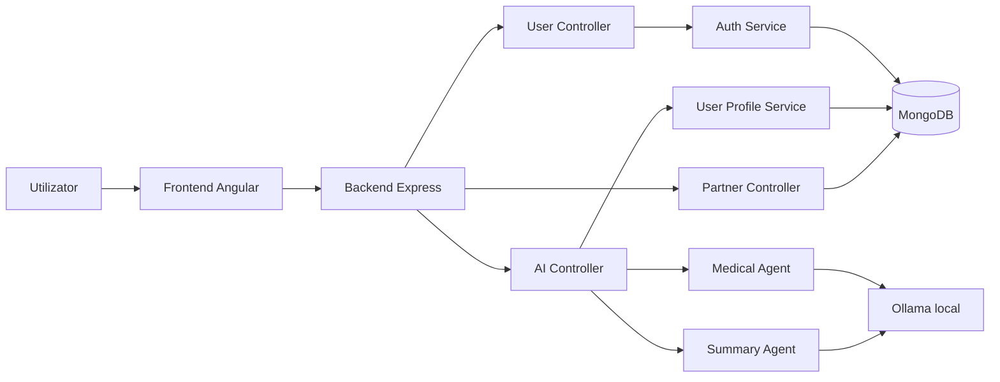
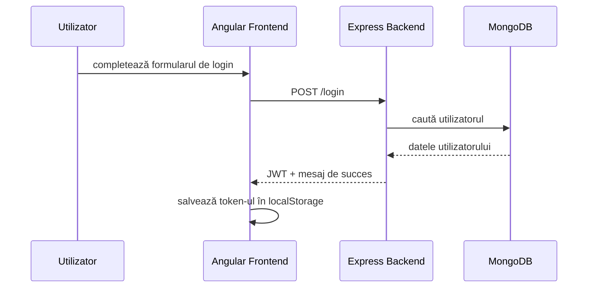
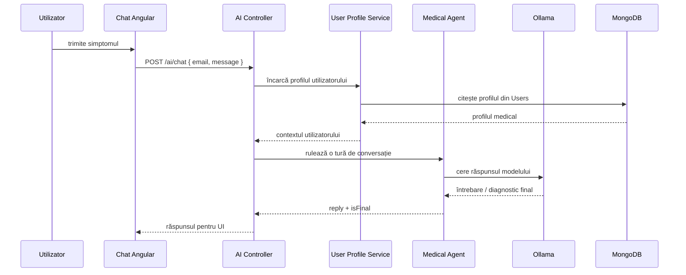

# Arhitectură

## Context general

MedHelp este o aplicație full-stack cu 3 straturi principale:

- frontend Angular pentru interfața utilizatorului
- backend Node.js + Express pentru logică și integrare
- MongoDB + Ollama pentru date și inferență AI

## Componente principale

## Fluxul de autentificare

## Fluxul de triaj AI

## Observații tehnice

- frontend-ul nu vorbește direct cu MongoDB sau Ollama
- sesiunea AI este ținută în memorie pe backend și este indexată după email normalizat
- la final de conversație, sesiunea este salvată în colecția `Sessions`
- modulul de sumarizare produce un raport clinic pentru parteneri/medici